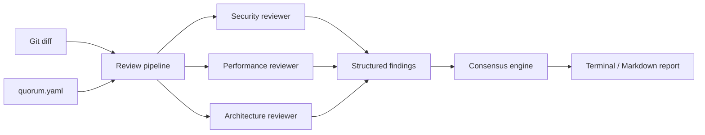
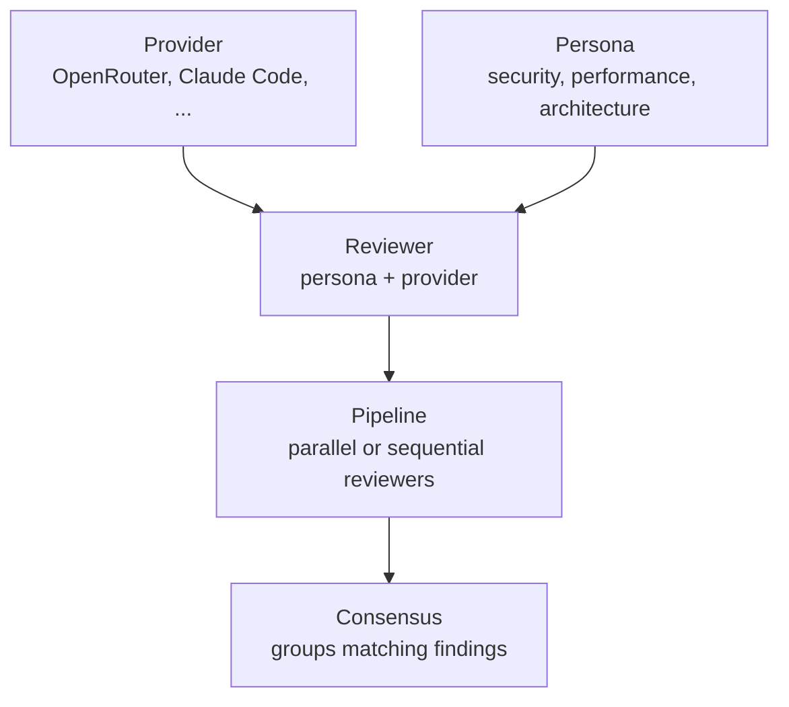
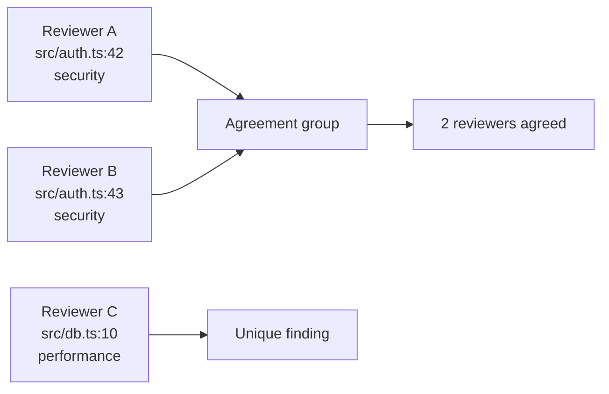

# Quorum

[](https://github.com/S1933/quorum-claude/actions/workflows/ci.yml)
[](https://bun.sh)
[](https://www.typescriptlang.org/)
[](#claude-code-plugin)

Provider-agnostic consensus review for AI-assisted code changes.

Quorum runs several AI reviewers on the same git diff, compares their findings, then highlights issues multiple reviewers agree on. It can run as a Bun CLI or as a Claude Code plugin.

## Why

Single-model review is noisy. Quorum treats review like a small panel:

- one diff
- multiple personas
- multiple providers or models
- one consensus report

## How It Works



## Core Model



## Features

- Provider adapters: OpenRouter and local Claude Code
- Portable personas independent from provider choice
- Parallel or sequential review pipelines
- YAML config with `env:VAR` and `${VAR}` secret interpolation
- Consensus grouping by file, line range, and category
- Terminal output and Markdown report rendering
- Claude Code slash commands

## Requirements

- [Bun](https://bun.sh) `>= 1.1`
- Git repository with changes to review
- Optional: `OPENROUTER_API_KEY` for OpenRouter-backed reviewers

## Install

```bash
git clone https://github.com/S1933/quorum-claude.git
cd quorum-claude
bun install
```

## Configure

```bash
cp quorum.yaml.example quorum.yaml
export OPENROUTER_API_KEY=sk-or-...
```

Minimal config shape:

```yaml
version: 1

providers:
  openrouter-claude:
    type: openrouter
    api_key: env:OPENROUTER_API_KEY
    model: anthropic/claude-opus-4

personas:
  security:
    description: Security review
    system: Find security risks in this diff. Be specific and cite lines.

reviewers:
  sec-opus:
    persona: security
    provider: openrouter-claude

pipelines:
  default:
    parallel: true
    reviewers: [sec-opus]
    consensus:
      strategy: overlap-v1
```

For a complete example with several reviewers, see [`quorum.yaml.example`](quorum.yaml.example).

## Use The CLI

```bash
# Review current changes against the default branch
bun quorum review

# Run a named pipeline
bun quorum review consensus-security

# Same, explicit flag
bun quorum review --pipeline consensus-security

# Print loaded config with secrets redacted
bun quorum config
```

## Claude Code Plugin

Install from the Claude Code plugin marketplace:

```bash
claude plugin marketplace add S1933/quorum-claude
claude plugin install quorum@quorum-plugins
```

Available slash commands:

| Command | Purpose |
|---|---|
| `/quorum-review` | Run the default review pipeline on the current diff |
| `/quorum-review <pipeline>` | Run a named pipeline |
| `/quorum-config` | Show loaded config with secrets redacted |

For local plugin development:

```bash
claude --plugin-dir ./plugin
```

Then run `/quorum:quorum-review` or `/quorum:quorum-config` in Claude Code.

## Consensus

V1 ships `overlap-v1`.

Findings are grouped when they share:

- same file path
- overlapping line range, with a two-line tolerance
- same category: `security`, `performance`, `architecture`, `correctness`, or `style`

Groups with multiple reviewers get an agreement badge. Single-reviewer findings are still reported separately.



## Project Layout

```text
src/
  cli/          Bun CLI entrypoint
  config/       YAML loading, schema validation, env interpolation
  consensus/    overlap-v1 strategy
  core/         pure domain types and contracts
  pipelines/    review execution
  providers/    OpenRouter and Claude Code adapters
  reviewers/    persona/provider binding
  runtime/      event bus, plugin lifecycle, workspace probing
  ui/           terminal and Markdown output
tests/          Bun test suite
plugin/         Claude Code plugin commands
```

## Develop

```bash
bun run typecheck
bun test
```

CI runs both commands on every pull request and every push to `main`.

## Roadmap

- More provider adapters, including local model runtimes
- Semantic deduplication beyond file and line overlap
- Contradiction detection between reviewers
- Per-reviewer trust and calibration
- CI-native review command
- Web dashboard

See [`docs/ARCHITECTURE.md`](docs/ARCHITECTURE.md) for the deeper design notes.
